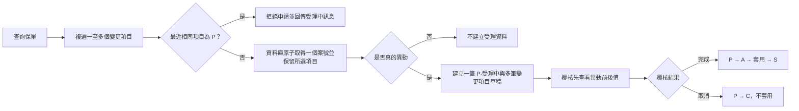
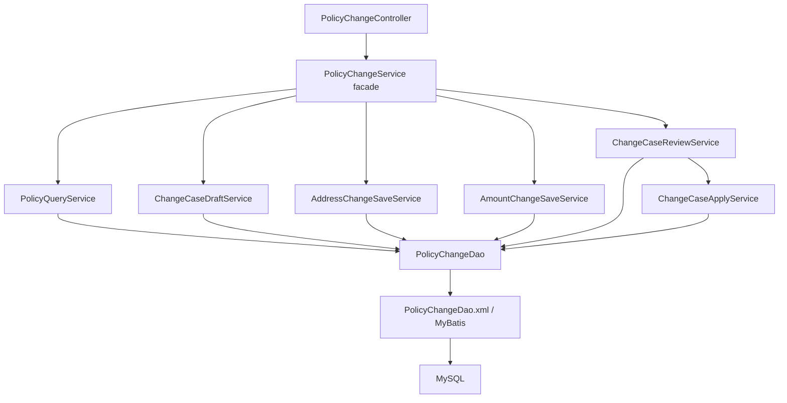

# POS API 保單服務後端

## 保單服務功能代碼

保單服務依資料實體拆成六個獨立畫面授權：`MPM00001`～`MPM00003` 分別查詢主檔、地址與主附約；`MPM00004`～`MPM00006` 分別異動主檔、地址與主附約。異動權限不互相涵蓋，覆核仍統一由覆核中心處理。

Local 與 Docker 的系統管理 Code Table 由相同 Flyway migration 建立及校正；環境內操作產生的 `main-code` 稽核索引與測試群組則各自保留，不以資料同步覆蓋。

> 資安基準請見 [`../目前所有的資安弱點.md`](../目前所有的資安弱點.md)。本機與正式環境都須自行提供 DB 與登入環境變數，版本庫不提供固定預設密碼。

壽險欄位命名、資料表定義與共通業務邏輯統一查閱 [`../欄位命名規則ＤＤ定義.md`](../欄位命名規則ＤＤ定義.md)。新增資料表、DTO、API、畫面欄位或保全流程前必須先查該文件；目前程式與目標規則的差異則記錄於 [`../專案欄位命名盤點.md`](../專案欄位命名盤點.md)。

覆核流程已採 `STAGED` 契約：Maker 提交只建立 `change_review` 暫存、pending-key lock 與稽核事件，不先異動正式表；Reviewer 核准為 `S` 時才由 `ChangeReviewApplier` 依 `record_version` 在同一交易套用正式資料，取消為 `C` 時正式資料保持不變。Admin 可直接完成，但仍建立 `S / DIRECT_APPLY` 稽核。既有 `LEGACY` 案件保留相容決策，避免重複套用歷史快照。

後端同時檢查角色與 `user_screen_authorization`：角色決定操作種類，功能代碼決定帳號是否可呼叫該畫面的 API。`change_review_pending_lock` 以資料庫複合主鍵確保相同 `function_code + unique_key` 只有一筆待處理案件。

保單查詢功能 `MPM00001` 至 `MPM00003` 僅允許讀取；保單主檔、地址與主附約的新增、修改及刪除統一要求 `MPM00004`「異動保單服務」。覆核仍集中於覆核中心，不在查詢或維護 API 提供獨立覆核入口。

保單查詢對代碼說明採容錯策略：例如缺少 `policy-contact/address_type_code/01` 時，仍回傳保單主檔、地址與主附約資料，只將 `communicationAddress` 留空；需要該代碼的保全異動則維持嚴格檢查並提示補齊代碼設定。

Flyway `V46__canonicalize_code_description_fields.sql` 會把歷史 `policy-contact/address_type` 對照遷移為 `policy-contact/address_type_code`，使原有通訊地址 `01`、戶籍地址 `02`、email `31` 可由新欄位命名正常查得。

V37 前已建立但尚未結案的地址覆核快照仍可能使用 `addressType`。覆核套用會相容讀取該舊欄位，若 JSON 未保存地址類型則以 `policy_change_record_snapshot.changed_record_key` 還原，避免地址 Key 變成 `null` 而無法完成；兩者皆缺少時才要求重新建立案件。

代碼對照跨服務同步採 MySQL binlog + Debezium CDC，正式來源為 `main.code_definition`，Topic 為 `pos.main.code_definition`。事件契約、重播、權限及部署方式請見 [`cdc/README.md`](cdc/README.md)；應用程式不做 transaction 後 dual-write publish。

本機啟動不內建 Admin 帳號或密碼。既有使用者由 `main.user_account` 讀取；若需要在啟動時補建 Admin，必須同時提供 `POS_ADMIN_USERNAME` 與至少 12 字元的 `POS_ADMIN_PASSWORD`。只提供其中一項或使用弱密碼時，應用程式會拒絕啟動，避免產生未受控的預設帳號。

IntelliJ 的 `POS API Local` 使用 local profile，會選擇性讀取 `pos-api/.env`。第一次啟動請複製 `.env.example` 為 `.env` 並填入本機資料庫連線；`.env` 已由 Git 排除，禁止把真實密碼填回 `application-local.properties` 或 Run Configuration XML。

使用者密碼的新建與重設採 Spring Security
`Argon2PasswordEncoder.defaultsForSpringSecurity_v5_8()`，資料庫格式為
`{argon2@SpringSecurity_v5_8}$argon2id$...`。登入端使用
`DelegatingPasswordEncoder` 相容既有無前綴 BCrypt 雜湊，舊密碼不得批次以未知明碼
重新產生；應在使用者重設密碼或後續登入升級流程中逐步轉換。

前端使用自有登入表單並在記憶體中送出 Basic Authorization header。後端 401 一律使用
`ResponseBodyDto` JSON，包含錯誤帳密時也不得回傳 `WWW-Authenticate`，否則瀏覽器會顯示
原生 Basic Auth 視窗並遮住 Vue 登入頁。

保單維護表單的基本資料規格也由 `main.code_definition` 管理：`UI-field-master`、`UI-field-address`、`UI-field-ride` 分別對應主檔、地址與主附約。`code_before` 保存 `text`／`number`／`select`／`datetime`，`code_after` 保存文字最大長度或數字 `precision,scale`，`code_description` 保存會透過 `/api/policy-ui-metadata/{entity}` 顯示在前端的繁體中文說明。只有存在且為啟用、覆核完成的設定才檢查；未建立設定就略過。

V49 依壽險 DD 擴充核心容量：所有關聯表的 `policy_no` 同步為 `VARCHAR(20)`，地址類型為 8 碼、地址／聯絡內容為 300 字、保障項目序號為 10 碼、商品代碼為 32 碼、保險金額為 `DECIMAL(18,2)`，保費為 `DECIMAL(18,4)`。遷移會先移除 FK、同步修改父子欄位後重建 FK，禁止只擴主檔而留下不相容的子表。

V50 進一步擴充「欄位內容」而非只有容量：

- `policy_contract`：保單狀態、契約／生效／滿期日、繳費與保障年期、期間類型、繳別、商品代碼／版本／名稱、主約商品、要保書、客戶及業務員代碼。
- 聯絡資料已正規化為 `policy_contact_address`、`policy_contact_email`、
  `policy_contact_phone`；地址、Email、電話不得再混放於同一欄位。
- 新資料技術識別碼使用後端產生的 UUID v7；完整規則見根目錄
  `壽險資料ID設計.md`。
- V52 已為保單契約、保障項目、保全案件、異動項目、欄位異動、快照、覆核與代碼定義
  建立獨立 UUID 欄位；`policyNo + policySeq` 等原業務鍵仍保留唯一約束。
- `policy_coverage`：商品名稱、所依附主約商品、繳別、繳費年期、保障期間類型、生效日及終止日。

新欄位先允許空值，因為既有資料無法可靠推導契約日期、客戶、業務員及聯絡方式。遷移只回填可明確組合的郵遞區號與地址，不從混合欄位猜測 email／電話／手機。

使用者畫面授權的覆核快照以 `{ "rows": [...] }` 保存 `user_screen_authorization` 全部欄位：`userId`、`functionCode`、`createdBy`、`createdAt`、`updatedBy`、`updatedAt`。覆核中心會將每列、每欄遞迴拆開顯示。

使用者授權頁的「新增使用者」會建立 `user_account` 登入帳號、以 BCrypt 保存初始密碼，並在同一交易寫入初始角色與 `S` 狀態稽核。「修改使用者」只允許調整啟用狀態與角色，使用者 ID 不可修改；密碼重設採獨立 API 與視窗，稽核內容只記錄重設行為，不保存密碼。系統會阻止管理員停用自己、移除自己的 ADMIN 角色，或停用系統最後一位有效 Admin。帳號清單 API 回傳帳號的建立／更新人員與時間；畫面授權清單則以該使用者授權列的最早建立資訊及最新更新資訊彙總回傳。覆核中心清單同步顯示 `change_review` 的建立／更新人員與時間。

目前專案與 DD 的差異、影響範圍及遷移順序請查閱 [`../專案欄位命名盤點.md`](../專案欄位命名盤點.md)。

核心邏輯表使用 `policy_contract`、`policy_contact`、`policy_coverage` 與 `policy_change_record_snapshot`；主約與附約共同資料以 coverage 命名。

保全流程表維持 DD 名稱 `policy_change_item`、`policy_change_field`、`policy_change_record_snapshot`；`change_item_code`、`changed_field_name`、`changed_record_type` 是欄位名稱，不得誤組成不存在的表名。

代碼建置索引由 Flyway V23 建立：`main-code / main-code / 001`，中文名稱為「代碼建置」。

`pos-api` 提供保單查詢、保全變更草稿、案件查詢與覆核回寫 API。前端可以先取得案號，但只有真的修改資料時，後端才建立受理檔與異動明細。

保單主檔、地址與主附約另提供一致的新增、修改、刪除 API，所有操作都建立覆核稽核軌跡，並集中至覆核中心決策。畫面所需英文欄位 metadata 由 `/api/policy-ui-metadata/{entity}` 回傳，中文名稱則由資料庫 `CHT-code` 維護，前端不寫死欄位名稱。像素欄寬由前端共用表格元件集中管理。

欄位 metadata 的後端責任是描述資料型態、長度、數字精度／小數位、必填、識別鍵、可編輯性與合法選項；像素欄寬、字級、間距及響應式版面屬於前端與 SCSS 的責任。

## 功能流程



### 變更項目

- 同一案號可包含任意筆有效且不重複的變更項目，不設定固定筆數上限；至少須選擇一項。
- `001`：地址、email、電話或手機變更。
- `002`：主約保額變更，只讀寫 `main_policy_ride` 的主約列（`ride_order = 000`），並保存主約完整 before/after 快照供查詢與覆核。
- `003`：附約保額變更，以 `coverageItemSeq` 定位正確附約，只接受 `coverageItemType=RIDER` 且序號不是 `000`；主約 `BASE/000` 由 002 處理。
- `004`～`006`：既有聯絡資料以 contactId 修改；查無資料時由後端產生 UUIDv7 並建立新增草稿，覆核通過後才寫入正式 email／電話表。

### 受理狀態

- `P`：受理中，等待覆核。
- `A`：覆核交易套用中，只供後端原子鎖定使用。
- `S`：完成，異動已回寫。
- `C`：取消，異動不回寫。

覆核完成使用條件更新將 `P` 改成 `A`。只有成功鎖定案件的交易能套用資料，再將 `A` 改成 `S`，可避免兩位覆核人員同時完成同一案件。

受理檔會記錄 `created_by`、`reviewed_by` 與 `reviewed_at`。啟用 Security 時，只有原建檔經辦可修改草稿，且建檔人不得覆核自己的案件。

## 案號規則

格式為：

```text
C + 民國年 3 碼 + 月 2 碼 + 日 2 碼 + 流水號至少 3 碼
```

例如 `C1150712001`。流水號由 `policy_change_case_sequence` 使用 MySQL 原子遞增與 connection-local `LAST_INSERT_ID()` 取得，支援多執行緒、多 Pod 與服務重啟；超過 `999` 後會自然成長為四碼以上。

取號時會寫入一筆 `policy_change_case_reservation`，綁定保單、經辦帳號及有效期限，並在 `policy_change_case_reservation_item` 保存所有勾選項目；預設保留 30 分鐘。同一案號可逐項儲存 `001`、`002`、`003`，第一次有實際異動時只建立一筆 `policy_change_acceptance`，各項目分別寫入 `policy_change_item`。自行拼湊、使用別人的、已過期、保單不符或未在取號時選擇的項目都會被拒絕。

取號前依 `policy_no + policy_seq + change_item` 查詢最近一筆已受理案件。最近狀態為 `P` 時回傳 HTTP 409 與「此保單正在受理中，無法申請」；最近狀態為 `S`、`C` 或沒有歷史案件時才可申請。前端可先呼叫 eligibility API 顯示結果，但 `POST /api/change-cases` 必須再次檢核，不能只信任前端。

## 草稿規則

`policy_change_field` 與 `policy_change_file` 使用商業唯一鍵保存目前有效草稿：

- 欄位草稿：案號、項目、欄位名稱與 `change_key` 唯一。
- 檔案快照：案號、項目、檔案名稱與 `change_key` 唯一。
- 重複儲存同一目標會更新最新值，不會累積多筆有效版本。
- 改回原值時會刪除該目標草稿；案件已無任何異動時，一併移除受理資料。

`change_key` 用來定位資料列：

- 地址：`address_type`。
- 主約列：`000`。
- 附約：`ride_order`。

查詢案件明細時，`changeFields.chineseName` 與快照欄位名稱都由 `CodeDescription` 的 `CHT-code` 提供，確保畫面用詞一致。

## 覆核衝突

覆核套用前會比較正式資料目前值與草稿的 `content_before`：

- 值相同才允許套用。
- 比較與回寫期間使用 `SELECT ... FOR UPDATE` 鎖定目標資料列；主附約固定先鎖主檔、再依序鎖附約。
- 若其他案件已先修改同一地址、主約或附約，回傳 HTTP `409 Conflict`。
- 每次回寫都檢查 affected row 必須為 1，避免資料不存在時仍顯示完成。
- 整個覆核在同一交易內執行；任何一項失敗都會回復案件狀態與主檔更新。

## API

所有成功與錯誤回覆都使用 `ResponseBodyDto<T>`；request body 不包 `ResponseBodyDto`。

| API | 畫面 | 用途 |
| --- | --- | --- |
| `GET /api/auth/me` | 登入頁 | 驗證帳號並取得 MAKER / REVIEWER 角色。 |
| `GET /api/policies/{policyNo}/{policySeq}` | 新增頁 | 查詢主檔、地址、主附約與代碼。 |
| `GET /api/postal-codes/{postalCode}` | 地址 Dialog | 查詢 3 或 3+3 郵遞區號地址前綴。 |
| `GET /api/policies/{policyNo}/{seq}/change-items/{changeItem}/eligibility` | 新增頁 | 查詢同保單與項目最近案件，判斷是否可申請。 |
| `POST /api/change-cases` | 新增頁 | 傳入 `changeItems` 複選清單並原子取得一個案號，不建立受理資料。 |
| `POST /api/change-cases/{caseNo}/address-change` | 001 Dialog | 儲存地址或聯絡資料草稿。 |
| `POST /api/change-cases/{caseNo}/main-amount-change` | 002 Dialog | 儲存主約保額草稿。 |
| `POST /api/change-cases/{caseNo}/policies/{policyNo}/{seq}/rider-amount-change` | 003 Dialog | 儲存附約保額草稿。 |
| `GET /api/policies/{policyNo}/change-cases` | 查詢／覆核頁 | 查詢案件清單。 |
| `GET /api/policies/{policyNo}/{seq}/change-cases/{caseNo}` | 查詢／覆核頁 | 查詢欄位與檔案快照；快照 JSON 依 `CHT-code` 拆成逐欄中文名稱與異動前後值。 |
| `PATCH /api/change-cases/{caseNo}/status` | 覆核頁 | REVIEWER 將案件改成 `S` 或 `C`。 |

## 資安弱點驗證來源

本專案使用多個公開來源交叉檢查已知弱點，避免只依賴單一資料庫：

| 網站／工具 | 用途 | 網址 |
| --- | --- | --- |
| Google OSV.dev／OSV-Scanner | 掃描 Maven、npm 直接與間接依賴，依套件版本比對公開弱點。 | [OSV.dev](https://osv.dev/)／[OSV-Scanner](https://google.github.io/osv-scanner/) |
| npm Audit | 依 `package-lock.json` 對照 npm 官方 Advisory，檢查前端 production 與 development dependencies。 | [npm Audit](https://docs.npmjs.com/cli/commands/npm-audit/) |
| GitHub Advisory Database／Dependabot | 依 repository dependency graph 持續追蹤新公布弱點；GitHub repository 必須啟用 Dependabot Alerts。 | [GitHub Advisory Database](https://github.com/advisories)／[Dependabot Alerts](https://docs.github.com/en/code-security/concepts/supply-chain-security/dependabot-alerts) |
| NIST NVD／CVE | 查核 CVE、CVSS、CWE 與受影響版本；由 OWASP Dependency-Check 進行 SCA 對照。 | [NVD](https://nvd.nist.gov/)／[OWASP Dependency-Check](https://owasp.org/www-project-dependency-check/) |

掃描報告預設放在 `logs/security-scan-YYYY-MM-DD.md`，原始 OSV／npm JSON 也放在 `logs/`。該目錄已由 Git 排除，避免報告中的本機路徑或環境資訊進入版本庫。掃描只能識別已公開且能正確對應版本的弱點，不能取代程式碼審查、權限測試、動態掃描與滲透測試。

## 架構



後端維持三層：

- Controller：HTTP、Bean Validation 與 `ResponseBodyDto`。
- Service：use case、交易與商業規則；每個 Service 都有 interface。
- DAO：`PolicyChangeDao` 由 MyBatis 直接建立代理，不再保留純轉呼叫的 DAO implementation 與 Mapper interface。

`PolicyChangeServiceImpl` 是薄 facade，不重複實作各 use case。

Spring Security 也遵守相同分層：`SecurityConfig` 只建立安全元件與讀取環境帳號，
`UserAccountSecurityService` 負責帳號同步交易及 `UserDetails` 組合，
`UserAccountSecurityDao.xml` 才能存放 `user_account`、`user_role_assignment` SQL。

Service package 依責任區分：

- `service`：對 Controller 或其他 use case 提供的 interface，例如
  `PolicyUiMetadataService`、`ChangeReviewApplier`。
- `service.impl`：上述 interface 的 Spring 實作。
- `service.validation`：壽險跨欄位驗證，不是獨立 use case。
- `service.support`：併發鎖與共用流程守門元件。
- `service.policy`：決定直接完成或送覆核等執行策略。

不為只有單一實作、且不構成應用 use case 的 Validator／Guard／Policy 建立空泛
interface；但不得把這些 concrete component 與對外 Service interface 混放在同一層。

## 快取與清除

- Caffeine 快取代碼查詢、使用者畫面功能、API 對應功能及登入用 `UserDetails`，降低每次請求重複查詢。
- 使用者密碼、啟用狀態或角色異動成功後，清除該 `userId` 的 `userSecurityDetails`；畫面授權異動後清除使用者功能代碼。
- 代碼對照表可能同時承載中文名稱、畫面功能與 API 授權規則，因此新增、修改、刪除、覆核後會一併清除代碼、`availableFunctionCodes` 與 `apiFunctionCodes`。
- `@CacheEvict` 只能標註由 Spring 代理呼叫的 public Service 方法；不得放在 private helper，否則不會執行。
- 快取是效能層，不是權限或資料真實來源；MySQL 仍是唯一事實來源，且只在交易成功回傳後清除快取。
- 目前 Caffeine 是單一 JVM 的近端快取。部署為多個 K8s Pod 時，必須用既有 CDC 管線、事件匯流排或 Redis pub/sub 將代碼與授權異動的失效事件廣播至所有 Pod；外部機制完成前不得把單機清除誤認為叢集一致。

## 兩階段優化結果

第一階段先恢復可驗證契約：修正前端測試／Story 路徑、後端整合測試資料與狀態流程、將同 Key 併發 deadlock 轉為 409 業務衝突、統一保障項目類型為 `BASE/RIDER`，並移除 local profile 的可用預設密碼。

第二階段將欄位寬度改為 metadata 驅動、導覽中文增加載入／失敗保護、補齊共用寬度判斷測試與設計文件。後續調整必須沿用「API 描述資料契約、前端 utility 選語意 token、SCSS 決定像素」的責任分工。

## 資料庫版本

資料庫結構由 Flyway 管理：

- `db/migration/V1__baseline.sql`：核心資料表、代碼與郵遞區號。
- `db/migration/V2__harden_change_case_workflow.sql`：原子流水號、草稿唯一鍵與更新時間。
- `db/migration/V3__add_cht_json_field_names.sql`：建立快照 JSON key 對應的繁體中文欄位名稱。
- `db/migration/V4__secure_change_case_audit.sql`：案號保留、建檔人、覆核人與覆核時間。
- `db/migration/V5__support_multiple_change_items_per_case.sql`：同一案號的多項預約明細。
- `db/migration/V30__create_change_review_audit.sql`：建立不可覆寫的覆核稽核歷程，逐筆保存送出、核准與拒絕事件。
- `db/migration/V31__add_change_review_detail_labels.sql`：補充覆核詳細內容使用的繁體中文 JSON 欄位名稱。
- `db/local/R__demo_policy.sql`：只在 `local` profile 補齊不存在的示範保單。使用 `INSERT IGNORE`，後端重啟時不得覆寫已完成保全異動的正式資料，否則待覆核快照會被誤判為其他案件修改。

正式環境不要手動重跑舊 `schema.sql`。資料庫本身需先建立，啟動時由 Flyway 套用尚未執行的版本。

## Security 與 CORS

所有環境預設 `POS_SECURITY_ENABLED=true`，缺少帳密時會拒絕啟動；只有 `local` 或 `test` profile 可以明確設為 `false`。Compose 預設也會開啟登入，並要求提供經辦與覆核帳密。正式環境使用 `prod` profile，除了登入外也強制 HTTPS：

```text
POS_SECURITY_ENABLED=true
POS_SECURITY_REQUIRE_HTTPS=true
POS_MAKER_USERNAME
POS_MAKER_PASSWORD
POS_REVIEWER_USERNAME
POS_REVIEWER_PASSWORD
```

- `MAKER`：查詢、取號、儲存 001／002／003。
- `REVIEWER`：查詢案件明細、完成或取消案件。
- 密碼至少 12 個字元；經辦、覆核帳號不可相同。
- MAKER 的案件清單只顯示自己建立的案件；REVIEWER 可查看待覆核案件。
- Basic Auth 正式流量必須經 TLS；反向代理需正確傳入 `X-Forwarded-Proto=https`。
- 未登入回覆 `401 ResponseBodyDto`，角色不符回覆 `403 ResponseBodyDto`。
- CORS 來源由 `CORS_ALLOWED_ORIGINS` 以逗號分隔設定。

資料庫帳密沒有程式預設值，必須由環境變數或 Secret 提供：

```text
DB_URL
DB_USERNAME
DB_PASSWORD
```

## 本機啟動

IntelliJ 可直接選擇 shared run configuration `POS API Local` 後按 Debug；此設定會啟用 `local` profile，載入正式 migration 與 `db/local` 測試資料。本機預設連線 `localhost:3306/main`，可再用下列環境變數覆寫。

```bash
export SPRING_PROFILES_ACTIVE=local
export DB_URL='jdbc:mysql://localhost:3306/main?serverTimezone=Asia/Taipei&characterEncoding=utf-8'
export DB_USERNAME='your-user'
export DB_PASSWORD='your-password'
export POS_MAKER_USERNAME='maker'
export POS_MAKER_PASSWORD='replace-with-at-least-12-characters'
export POS_REVIEWER_USERNAME='reviewer'
export POS_REVIEWER_PASSWORD='replace-with-another-12-characters'
mvn spring-boot:run
```

安全設定支援同一個 `userId` 擁有兩個以上角色。內建角色組合為 `maker = ROLE_MAKER + ROLE_USER`、`reviewer = ROLE_REVIEWER + ROLE_ADMIN`；正式環境啟動時會合併而非覆蓋 `authorities` 中既有的其他角色。若多個角色環境變數使用相同帳號，密碼也必須一致。即使使用者同時具有經辦與覆核角色，仍不得覆核自己建立的資料。

使用者授權 API：

- `GET /api/user-authorizations/users`：USER、ADMIN 查詢所有 userId 與角色集合。
- `POST /api/user-authorizations/users/roles`：ADMIN 對既有 userId 新增角色。
- `PUT /api/user-authorizations/users/roles`：ADMIN 取代既有 userId 的完整角色集合。

POST／PUT 不修改密碼且不經覆核，寫入後立即生效；同一交易會建立功能代碼 `MUS00001`、狀態 `S` 的 `change_review` 與 `change_review_audit`，保留異動前後角色、Admin 操作人及時間。

寫入前會以 `MUS00001 + userId` 查詢並鎖定相同業務 Key；若已有 `P` 狀態資料留在待處理佇列，API 回覆 409 並拒絕重複新增或修改。直接完成的新資料維持 `S`，不會進入待覆核佇列。

所有資料維護畫面的修改 API 共用 `PendingReviewGuard`。保單主檔、地址、主附約、代碼對照表及使用者授權皆以「功能代碼＋完整業務 Key」檢查 `P` 佇列；相同 Key 正在處理時回覆 409，不允許後送修改覆蓋先送資料。保全變更則沿用保單與變更項目的受理中檢核。

覆核資料的 `unique_key` 保存來源資料全部主要 Key，使用 `|` 依固定順序組合。覆核查詢 API 使用通用參數 `key1`：保單資料對應 `policy_no`，代碼資料對應 `code_group`；同時比對完整 Key、案號及異動快照識別值，不再提供序號獨立查詢參數。

`user_screen_authorization` 保存 userId 與多個功能代碼，畫面授權直接掛 userId 而不是由角色動態推算。`GET /api/auth/me` 回傳角色與實際功能代碼；`GET /api/user-authorizations/users/screens` 供 USER、ADMIN 查詢，`PUT /api/user-authorizations/users/screens` 的契約為 `userId + functionCodes`，僅 ADMIN 可修改。角色與畫面都可複選；異動立即為 `S` 並建立 `MUS00001` 稽核。資料庫實體欄名沿用 `username`，不對外暴露。

角色與畫面授權完全分離：角色新增、修改及應用程式啟動都不會自動增刪畫面；只有 Admin 對 userId 儲存的 `functionCodes` 會影響選單與路由。既有畫面授權保留，避免部署時意外清空使用者權限。

預設 API：`http://localhost:8081`。

健康檢查：

```text
GET /actuator/health/liveness
GET /actuator/health/readiness
```

## 測試與 CI

```bash
mvn test
mvn clean verify
```

- 一般單元測試不連本機 MySQL。
- `SecurityAuthorizationTest` 驗證 401/403 `ResponseBodyDto`、MAKER/REVIEWER 分權、假案號、負數保額、登入身份與 CORS origin。
- `PolicyChangeSupportServiceImplTest` 與 `ChangeCaseReviewServiceImplTest` 驗證案號擁有者、逾期案號及 maker-checker 稽核欄位。
- `PolicyChangeWorkflowIntegrationTest` 使用 MySQL Testcontainers 驗證 Flyway、原子案號、無異動、重複儲存、過期案件及兩案同時覆核衝突。
- Docker 未啟動時整合測試會略過；GitHub Actions 的 Docker 環境會完整執行。
- `.github/workflows/ci.yml` 在 push 與 pull request 執行測試、打包與 Docker build。
- `.github/workflows/security.yml` 每週及主分支異動執行 CodeQL 與 OSV；Dependabot 每週檢查 Maven、Docker 與 Actions。

## Docker

### 中文欄位標籤與登入快取

- 畫面欄位與導覽中文由 `code_definition` 的 `CHT-code`、`main-navigation` 提供，前端只保留穩定 key。
- CHT-code 只讀取 `active_flag=Y`、`review_status=S` 的已生效資料，中文優先使用 `code_description`。
- 不快取 Spring Security 的 `UserDetails`；驗證成功後框架會清除物件中的密碼，快取該物件會讓下一個 API 誤判為空密碼並回傳 401。
- 帳號資料使用 MyBatis record 建構子明確映射，避免 `password` 欄位因別名或編譯參數差異被映射成 null。

### 前端共用表格

- 所有 API 清單（保單、地址、主附約、代碼、保全案件、覆核中心與使用者授權）共用 `ScrollableRecordTable`。
- 表頭與資料列使用同一組 Grid 欄寬及整表最小寬度；欄寬由目前頁面的表頭與實際資料內容共同計算，並設定合理上下限。內容超過可視寬度時才顯示水平捲軸。
- 文字與數字均採左對齊，確保同欄上下位置一致；各頁不得再建立自己的清單 Grid 或固定欄寬。

### 覆核中心篩選

覆核中心可依功能代碼、覆核狀態（P 受理中、S 已確認、C 已取消）及主要查詢鍵組合查詢；空白條件代表不限制，分頁總筆數會使用相同條件計算。

完整的「建置前後端 image → 本機驗證 → 推送 Registry → 部署主機 pull →
MySQL 備份 → 啟動與健康檢查」程序統一維護於
[`../pos-web/readme.md`](../pos-web/readme.md#docker從建置映像推送到啟動)。
正式部署請使用該流程與 `pos-web/compose.yaml`，不要只單獨啟動 API image。

```bash
docker build -t pos-api:latest .
```

Dockerfile 使用 BuildKit cache 保存 Maven 本機倉庫，runtime 採目前掃描無 Critical／High 的 Temurin UBI minimal JRE、不再額外安裝套件，並以 UID `10001` 非 root 執行。建置與執行映像都固定 image digest；升級時須同步掃描弱點並提交新的 digest。Compose 將 API 設為唯讀檔案系統、移除 Linux capabilities，且只綁定本機回圈位址。

前後端與 MySQL 建議由 `pos-web/compose.yaml` 一起啟動，避免 port、network 與資料庫環境設定不一致。

## SQL Log 與個資

MyBatis 原始參數 log 維持關閉：

```properties
mybatis.configuration.log-impl=org.apache.ibatis.logging.nologging.NoLoggingImpl
logging.level.com.alin.lin.dao=info
```

Debug SQL 統一由 `MaskedSqlLogInterceptor` 輸出，保單號碼、地址、email、電話與手機會遮罩。非 `prod` 環境同時輸出 stdout 與 rolling file；`prod`（包含 K8s）只輸出 stdout，由集中式日誌系統收集，不在 Pod 內建立日誌檔案，也不把一般技術 Log 寫入業務資料庫。

Rolling file 每檔上限 100 MB、最多保留 30 天，且總容量限制為 3 GB，只供本機與非正式環境使用。需要長期保存且具業務意義的操作紀錄應另建稽核資料，不應混入一般技術 Log。
# 正式部署安全設定

`main.code_description` 的 `main-screen/screen` 對照表定義四個畫面支線：`CREATE`、`UPDATE`、`DELETE` 僅對應 `MAKER`，`REVIEW` 對應 `REVIEWER`。查詢保單時一併回傳給前端；實際 API 權限仍由 Spring Security 後端控管。

`prod` profile 使用 JDBC 帳號表 `users` / `authorities`，啟動時以環境變數提供的帳號密碼建立或更新 BCrypt 雜湊；資料庫不保存明文密碼。`local` 與 `test` 才使用 In-Memory 帳號。

正式部署前請先執行前端專案的 `./backup-mysql.sh`，再啟動 API。Flyway migration 是 forward-only，若需回復必須使用部署前備份與上一版 image，不可修改已套用的 migration。
# Code 代碼 API

`GET /api/user-authorizations/codes` 讀取 `main.code_description`，回傳標準 `ResponseBodyDto`。SQL 使用明確 camelCase alias 對應 `CodeDescription` entity，避免資料庫 snake_case 欄位在 API 顯示為空白。

代碼維護 API：Maker 可使用 POST、PUT、DELETE；Reviewer 僅可查詢，覆核流程需依正式覆核狀態欄位另行落地。

PUT 修改代碼時鎖定 `code_group/code_field`，可變更 `code_before` 及其下方業務、狀態與稽核內容；request 另外傳入 `originalCodeGroup/originalCodeField/originalCodeBefore` 定位原資料，後端會拒絕不存在的原 Key 或重複的新 Key。

代碼查詢規則：`main-code` 只收集業務用 `code_group`，不包含角色與權限；`code_field` 對應實際 `code_group`，`code_before` 由 `1` 起算。角色權限維持由 `users` 與 `authorities` 管理。

畫面功能代碼集中存放於 `main-screen/function_code`。`MPS00001` 為申請保全變更、`MPS00002` 為查詢保全變更；保單查詢使用 `MPM00001`～`MPM00003`，保單異動使用 `MPM00004`～`MPM00006`；`MCM00001` 為查詢代碼對照、`MCM00002` 為異動代碼對照；所有覆核統一由 `MPS00003` 覆核中心處理，`MUS00001` 為使用者授權。前端畫面名稱與功能路由應以此對照表為來源。

代碼 API 依 HTTP 方法分權：GET 可由 `MCM00001` 或 `MCM00002` 讀取，POST／PUT 僅允許 `MCM00002`。代碼異動仍建立 `MCM00002` 的 P 狀態稽核軌跡，但異動畫面不提供覆核按鈕；決策只能在覆核中心完成。

API 與畫面功能代碼的對照維護於 `api-screen-authorization`：`code_field` 是 HTTP method、`code_before` 是 API 路徑前綴或 Ant path pattern、`code_after` 是允許的功能代碼。`ScreenAuthorizationFilter` 只讀取這份設定，不保存保全、保單、代碼或使用者授權的固定功能代碼；V58、V59 建立現行完整對照。

保全項目 `001`～`006` 均可在同一案號選取並分別儲存：001 地址、002 主約保額、003 附約保額、004 電子郵件、005 市內電話、006 行動電話。聯絡資料以既有 email／phone UUID 定位，覆核通過後才套用正式保單資料。

`GET /api/function-codes` 只回傳 `main-screen/function_code`，供所有已登入角色在每個作業畫面右上方顯示功能代碼，不需要開放完整代碼對照表權限。

`GET /api/navigation-labels` 回傳 `main-navigation/navigation_label`，供 Router 依穩定 key 產生側邊導覽中文；`GET /api/field-labels` 只回傳 `CHT-code` 欄位名稱。兩支唯讀 API 對所有已登入角色開放，不要求 `MCM00001`，避免一般保單查詢者因沒有代碼維護權限而看不到中文欄位。V53 同時補齊導覽、共用表頭與角色顯示名稱。

共用覆核檔 `change_review` 另外保存 `source_record_type` 與 `source_record_id`，可定位來源是異動欄位檔、異動檔案檔或代碼資料。覆核畫面可依功能代碼、來源檔案、保單號碼、序號與狀態查詢；保單條件留白時代表不篩選。

`change_review` 保存目前覆核狀態，`change_review_audit` 保存不可覆寫的歷史事件。建立覆核主檔時追加 `SUBMIT (NULL -> P)`；覆核決策先以 `SELECT ... FOR UPDATE` 鎖定主檔，只允許 `P -> S/C`，再於同一交易追加 `APPROVE` 或 `REJECT`。建檔人不可覆核自己的異動，重複或併發決策回覆衝突，不得覆寫既有稽核事件。

可透過 `GET /api/change-reviews/{reviewKey}/audits` 依時間取得完整稽核軌跡。事件包含操作者、異動前後狀態、拒絕說明、內容快照及可用的 `requestId/traceId`，其中內容不得保存密碼、Authorization、Cookie 或不必要的完整個資。

`GET /api/change-reviews` 的 `functionCode`、保單號碼與序號皆可留白；預設回傳全部覆核資料的第一頁。後端固定每頁 20 筆，以 `created_at DESC, id DESC` 由新到舊排序，並回傳總筆數與總頁數。

角色代碼已由 V18 從 `code_description` 移除，正式角色資料仍保留在 `users` 與 `authorities`。

`main-screen` 為畫面權限資料，不列入代碼對照表；由使用者授權流程管理。

`main-user` 為使用者授權資料，不列入代碼對照表；由 `users` 與 `authorities` 管理。

使用者授權與畫面授權查詢會在 Service 層統一處理資料庫時間型別。MyBatis／Connector/J 回傳 `LocalDateTime` 或 `java.sql.Timestamp` 都可正常轉成 API DTO，避免 Admin 開啟 `MUS00001` 時因驅動型別差異顯示「系統發生未預期錯誤」。

V62 會移除舊版啟動腳本誤寫入的 `${POS_*_USERNAME}` placeholder 帳號及其角色、畫面授權；有效的 `admin`、`maker` 等 userId 不受影響。

V63 補齊保全受理動態清單的 `acceptanceStatusDescription` 與
`changeItemCodeCodes` 中文 DD。資料表與明細由 API key 動態展開，中文名稱統一查詢
`CHT-code`；Vue 畫面不保留另一份固定欄位名稱。

V64 會重建標準 `CHT-code` 中文欄名集合，統一 API DTO、覆核、授權、保單、
聯絡方式、保障項目與稽核欄位的中文名稱。既有重複或不一致資料會先移除再以
標準 key 寫回，避免同一英文欄位在不同畫面顯示不同中文。
